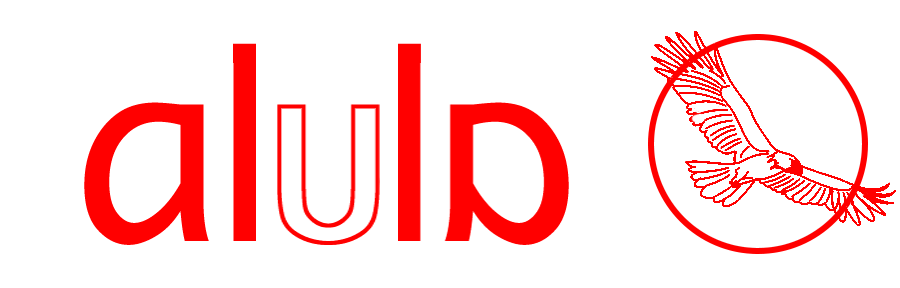

# alula



Welcome to Alula, the language that does away with the semicolon, but embraces the colon. Alula is a static, strongly typed programming languages that focuses on parallelism and simplicity through the standardized use of the colon. Alula takes inspiration from Python, with hints of Elm.

In many programming language, the equal sign has many contextual uses. For example, in JavaScript, a single equal sign (=) is used to declare, while a double or triple equal sign (==/===) is for comparing. The overuse of such a character can cause unnecessary confusion. In Alula, the equal sign is utilized, but only for the comparison of values. All declarations, statements, and function calls begin with a colon, allowing for an easier understanding for those unfamiliar with the language. In Layman's terms, anything that can be called to do something begins with a colon.

### Features
* All variable declarations, function calls, and and conditional statements require a colon to designate the beginning
* Any arguments are separated with a comma directly after the colon
* Chained functions are separated by ->, designated another "step"
* Parenthesis are exclusively used for logic and arithmetic precedence
* Parameters for functions occur after the colon, but before the curly brackets. Multiple parameters are separated with commas

| Alula                     | JavaScript         | Description   |
| ------------------------- |:----------------:| ---------:|
| type name: value   | var name = value; | Variable Declarations|
| function funcName: arg1, arg2 {..} | function funcName(arg1, arg2) {..} | Function call |
| if: conditional {...} | if (conditional) {...}           | if-statements |
| while: conditional {...}| while(conditional) {...} | while-loop |
| for: num i:0, i < max, i++ {...} | for (var i = 0; i < max; i++) {...} | for-loop |
| return: 0 | return 0; | return statement |
| variable -> getValue: 12 -> getMax -> toString | variable.getValueAt(12).getMax().toString() | Chain-able Functions
| num answer: sum: 5, 3 | let answer = sum(5,3) | Single Functions
| # single line comment | // single line comment | Single line comment |
| #: block comment :# | /\* block comment */ | Multiple line comment |


* Alula contains 7 types. They are declared as followed
  * num numberVariable: 2
  * bool booleanVariable: false
  * string stringVariable: "This is text."
  * list listOfVariables&lt;type>: ["List", "of", "four", "variables"]
  * dict dictionaryOfVariables: {John: "Scott", J: 4, Olive: true}
  * struct aStructure: {...}
  * undefined

### Examples
Hello World
```
print: "Hello World"
```

##### Fibonacci Sequence
Iteratively finds fibonacci number at the nth index value
```
function fibonacci: num position {
  num result: 1
  for: i: 1, i < (position -> length), i++ {
    result +: result
  }
  return: result
}
```

##### Average
Finds the average of a list of numbers
```
function average: num list {
  num multiplied: 1
  for: i:0, i < (list -> length), i++ {
    multiplied *: list[i]
  }
  return multiplied / (list -> length)
}
```

##### Check Odd / Even
Returns odd or even based on the input
```
function oddOrEven: num number {
  if: number % 2 == 0 {
    return: 'even'
  } else:
    return: 'odd'
}
```

##### Closure
A basic closure that finds the previous x value and multiplies it by y
```
function closure: num x, num y {
  currentX: x
  return: function next: {
    currentX: currentX * y
    return: currentX
  }
}

closureVariable: closure: 3, 2    
closureVariable -> next
```
